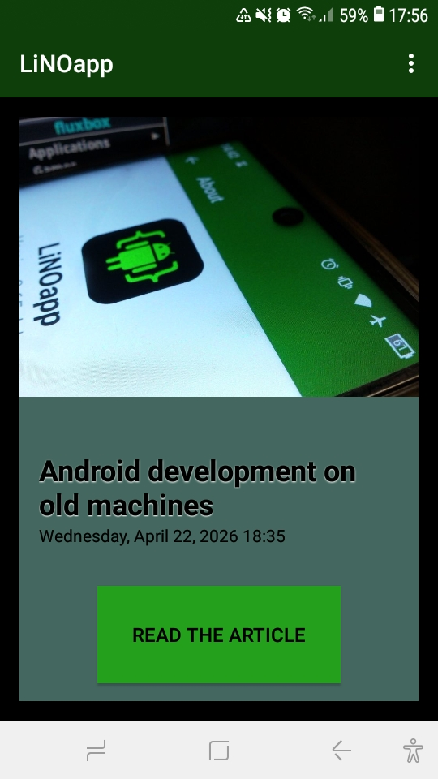
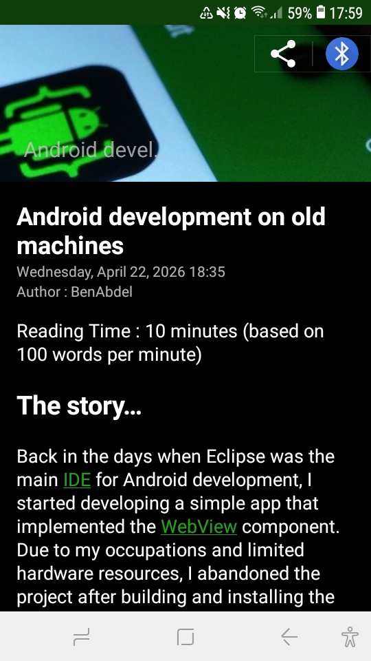
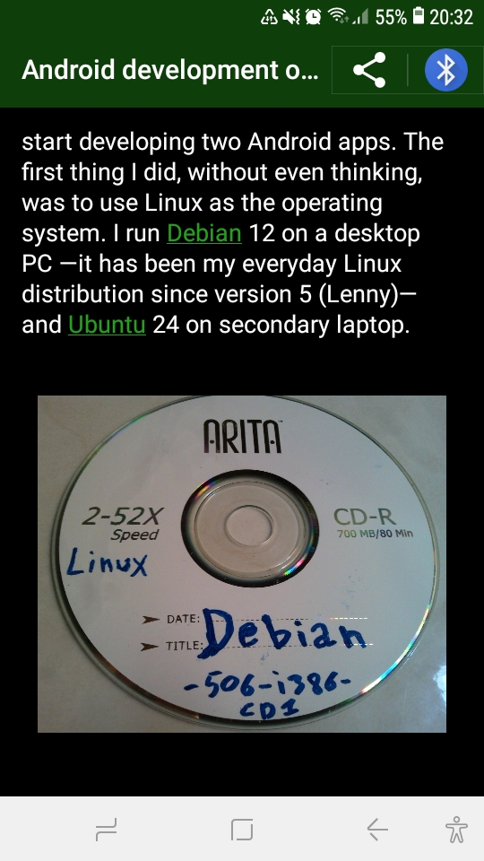

# Android WordPress REST API app
An easy user case for using WordPress REST API in the Android Platform (developed in JAVA with legacy android support library)

Based on this project : https://github.com/Mahjouba91/android-wp-restapi-example

The aim is to display all posts of my blog on the Android app, then to display Single Post template like (a child activity).

## Libraries
In this example, I used some great libraries and Android API :
* Retrofit : A JAVA library to make REST API calls easily
* Picasso : An Android library to set an ImageView with an URL
* Material Design support for Cards
* Collapsing toolbar to have a nice parallax effect with the post thumbnail
* CircleImageView : Popular circle image library 

## Features
- Theme chooser
- Article sharing
- Load and network handling  
- Native Android interface

## Build
Open with Android Studio Bumblebee and sync Gradle.

## Screenshots
| Main Activity | Article | Article image |
|------|---------|---------|
|  |  |  |

## Developer
Developed by Benlamine Abdelmourhit (abdelmourhit01@gmail.com)
